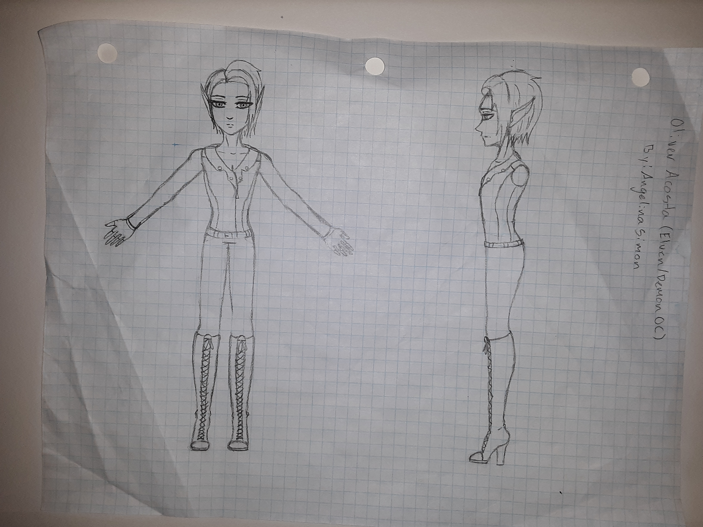
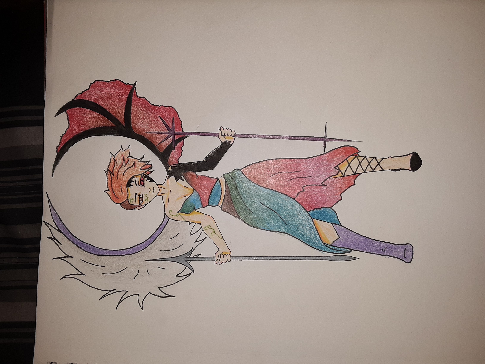

# Angelina's Portfolio

A Dreaming Artist

## About Me

I am a self taught animator and artist who draws almost everyday. I create many different pieces, including multi-media, pen, pencil and other medias. I strive to become an animator one day for either a large company or to make a profit off my own animations through different social media platforms. My imagination is constantly churning up new and intresting ideas. Most of them being ideas involving mystical creatures. A topic I am very fond of.

## My Resume

I have not been in a work environment that requires my artistic abilities. Although at my current work position I am a hard working employee who strives to climb up the ladder of employment. I push myself to become a succesful working citizen.

## My Voluntary Work

I tend to do voluntary work for others. I help with what I can at work, at times it may be with helping out a co-worker gather materials or help fix a problem that arrives without the thought of getting anything in return. I help the team with problem solving and quick yet effective solutions to problems that arrive.

### Samples of My Drawn Art

## Traditional Pieces

The drawing above is a original character I had modeled in my advanced anmation class during my senior year of high school. My teacher had given us an assignment to create a character then to use Maya, a 3D art program, to build and rig the model. The requirments having been, a two legged creature with distinguishable facial features, that being the mouth, nose and eyes.

The drawing above is a self reflection on how as a individual there is always the good and the bad side to them. Essentially two sides of the same coin. Depending on the situation at hand either side could play the leading role. A strong bond with a close family memeber will most likely be on the light or good side. While on the other hand a once trustworthy realtionship is broken would have the dark or bad side in response.

## Digital Pieces

